

> Welcome to ParkCatch! Your Smart Parking Solution.

  

 

**[PROJECT PHILOSOPHY](#project-philosophy) • [PROTOTYPING](#prototyping) • [TECH STACK](#tech-stack) • [DEMO](#demo) • [IOT](#iot) • [PERFORMANCE](#performance)• [HOW TO USE](#how-to-use)**

  

> ParkCatch allows drivers to find available parking lots nearby and reserve whatever available spot they want. It also provides directions from their current location to the destined parking lot.

<strong>User Stories</strong>
- As a client, I want to see the available parking lots nearby so that I can choose one of them.
- As a client, I want to choose from the available spots in the parking lot so that I can reserve the spot I want.
- As a client, I want to pay online through my card so that I confirm my reservation.
- As a client, I want to get the directions to the chosen parking lot so that I know which route to take.

 

<strong>Parking Lot Supervisor Stories</strong>
- As a supervisor, I want to see spots being reserved and the available ones so that I can track the traffic.
- As a supervisor, I want to get alerted if a spot is being taken by an unauthorized client so that I can reach out to the client and solve the issue.
- As a supervisor, I want to terminate the reservation of a client so that he/she will have to leave immediately in case of a conflict.
- As a supervisor, I want to make spots unavailable for clients during a certain time so that I can save them for specific people and make them available later on in case of an event and avoid the conflict of these spots being busy.

 

<strong>Admin Stories</strong>
- As an admin, I want to access the spots reservation prices so that I can change the price when needed.
- As an admin, I want to access the banned list so that I can add the license plate number of any client that has violated the company’s policy.
- As an admin, I want to have control over the parking spots Availability on the website so that I can add or remove a spot availability if it's under maintenance.
- As an admin, I want to access the supervisors page so that I can create accounts for new supervisors.
- As an admin, I want to access the parking lot availability hours so that I can change the time when it opens and closes.

  

> ParkCatch was designed by employing wireframes and mockups in an iterative design process, achieving an optimal layout for user-friendly navigation and a seamless user experience.

 

<strong>Mockups</strong>

<strong>Client Screens (MobileApp)</strong>

| Login                             | SignUp                            | Home                             | Home                             |
|-----------------------------------|-----------------------------------|----------------------------------|----------------------------------|
| 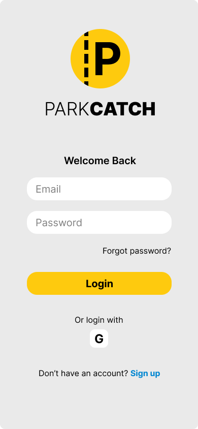 |  | 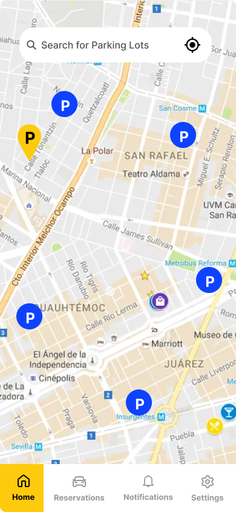 | 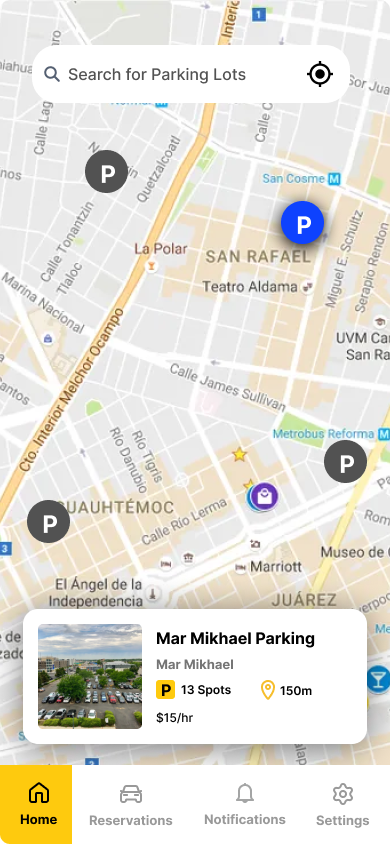
|
| Spots                             | Reservation Info                  | Reservation Payment               | Reservation Ticket                |
|-----------------------------------|-----------------------------------|----------------------------------|----------------------------------|
| 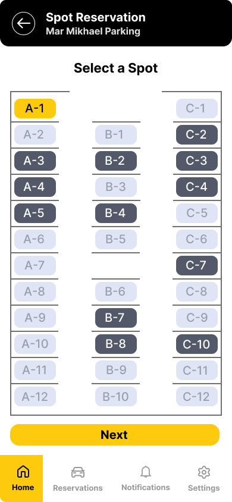 | 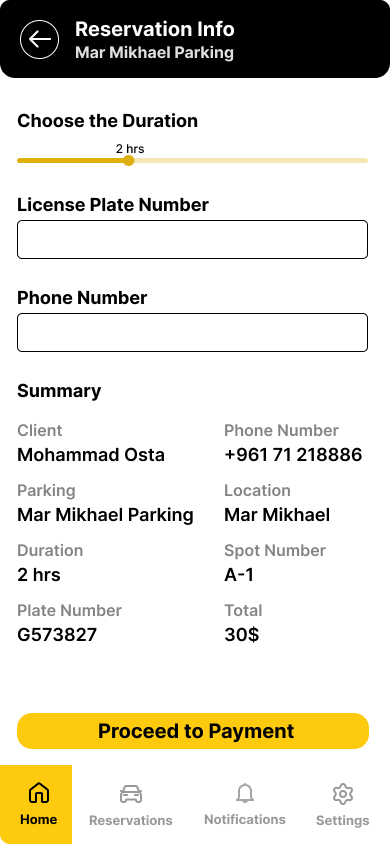 |  | 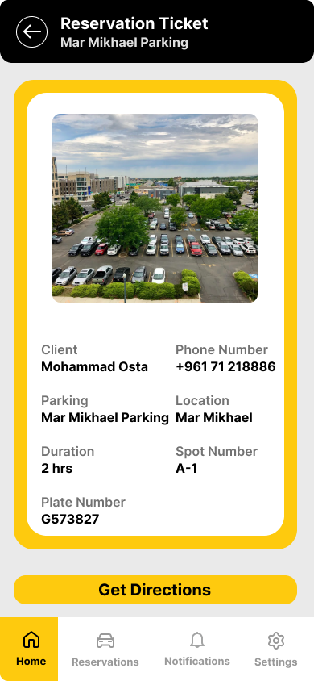 |
|
| Directions                        | Settings                          | Change Info                       | Change Password                   |
|-----------------------------------|-----------------------------------|----------------------------------|----------------------------------|
|  | 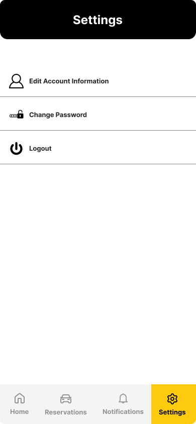 | 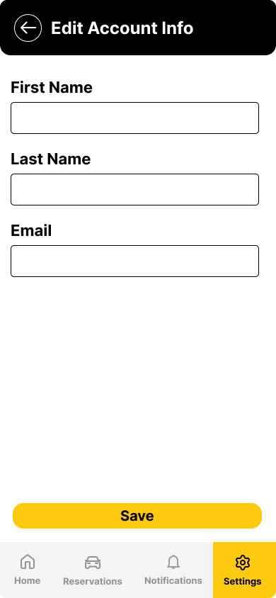 | 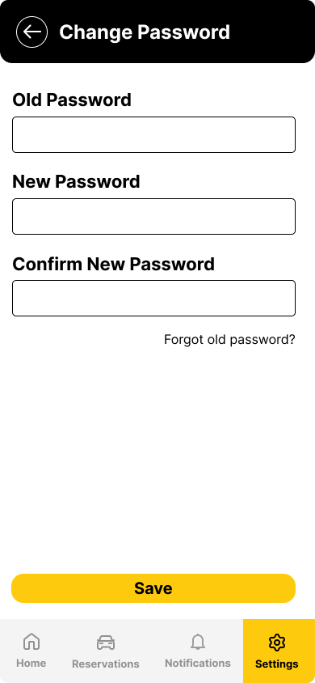 |

 

<strong>Website</strong>

| Login                                                            | 
|------------------------------------------------------------------|
| 

 

<strong>Supervisor Pages (Website)</strong>

| Home                                                             | Reservation Alert                                                 |
|------------------------------------------------------------------|-------------------------------------------------------------------|
| 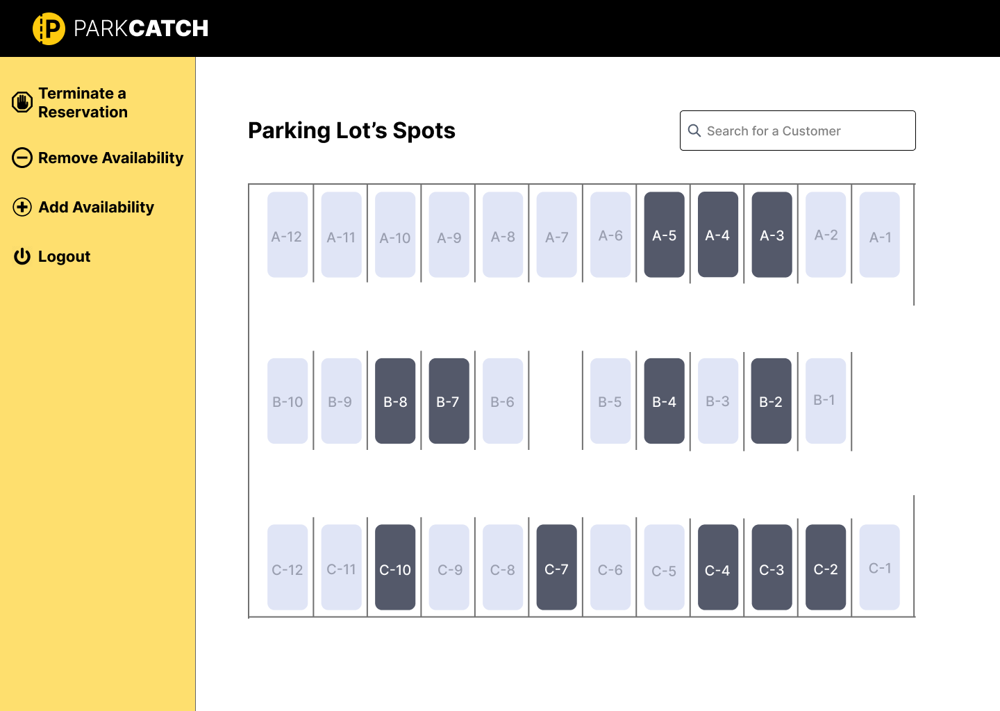 |  |

| Reservation Search                                               | Reservation Termination                                           |
|------------------------------------------------------------------|-------------------------------------------------------------------|
|  | 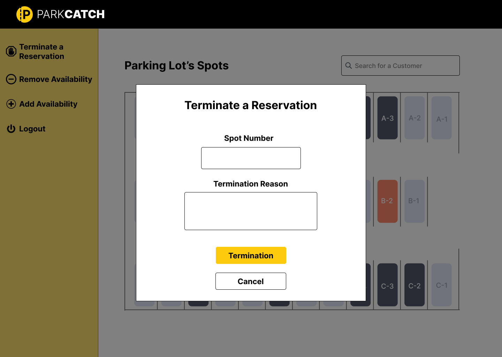 |
 
| Remove Availability                                              | Add Availability                                                  |
|------------------------------------------------------------------|-------------------------------------------------------------------|
| 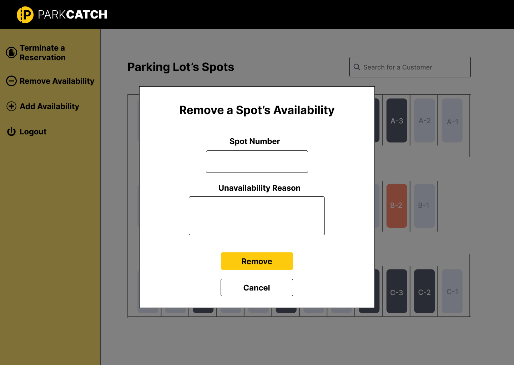 | 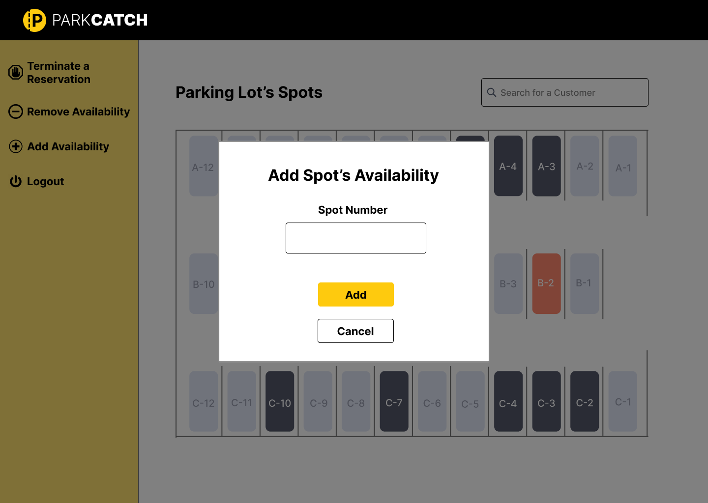 |

 

<strong>Admin Pages (Website)</strong>

| Home                                                             | Edit Spot's Details                                               |
|------------------------------------------------------------------|-------------------------------------------------------------------|
| 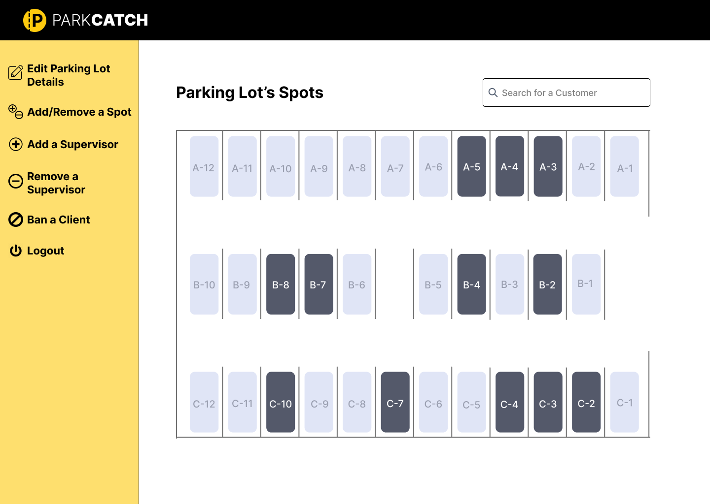 |  |

| Ban a Client                                                     | Add a New Supervisor                                              |
|------------------------------------------------------------------|-------------------------------------------------------------------|
|  | 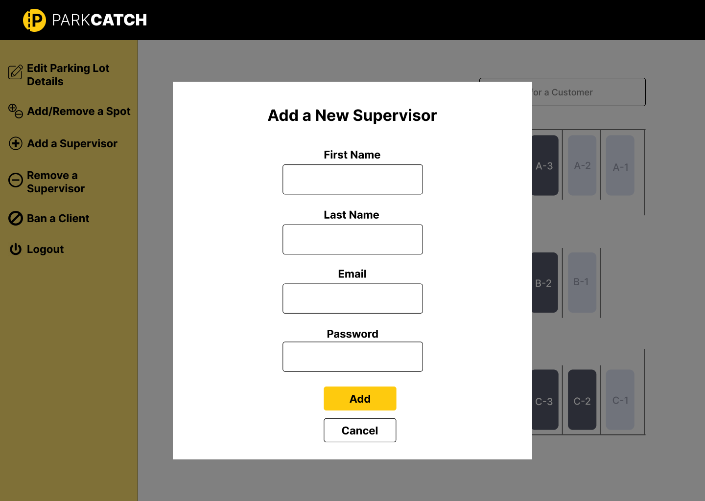 |

| Remove a Supervisor                                              |
|------------------------------------------------------------------|
| 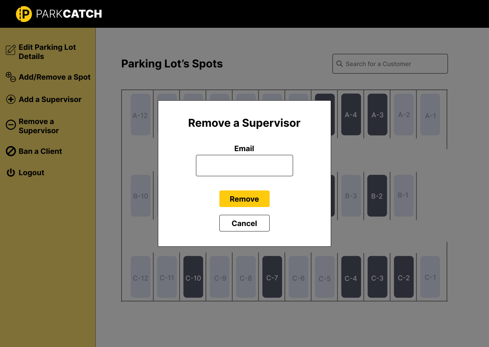 | 

  

