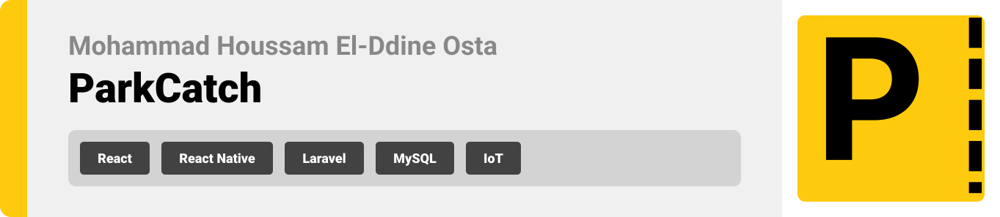
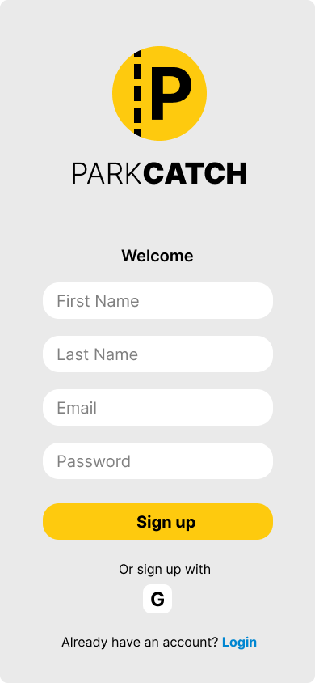
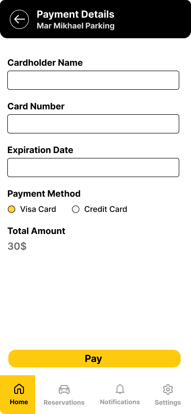
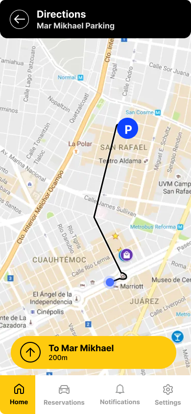
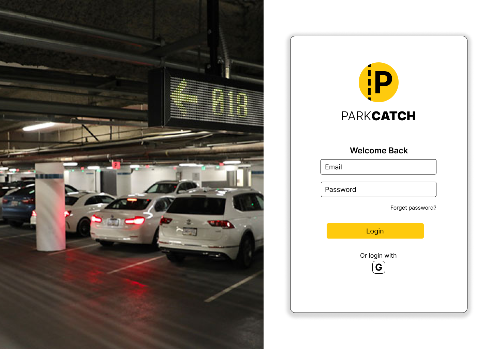
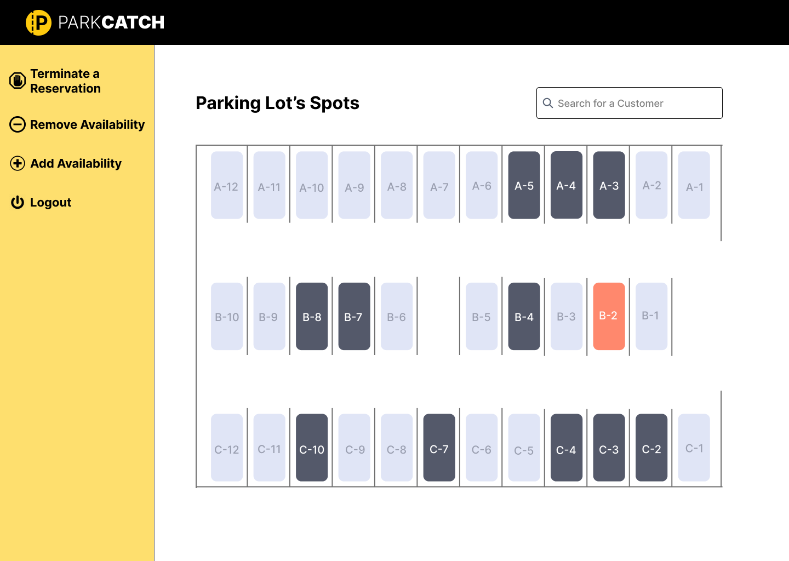
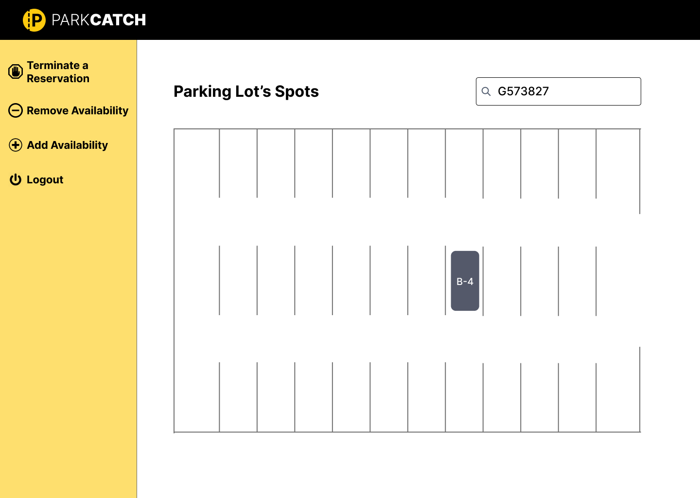
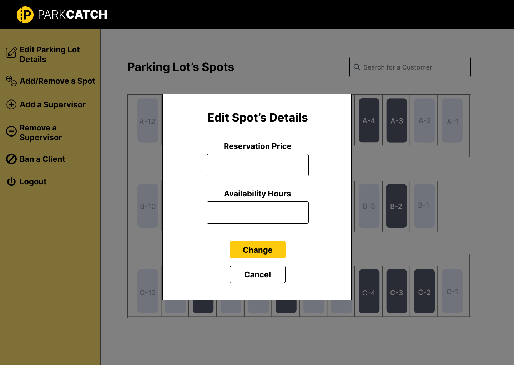
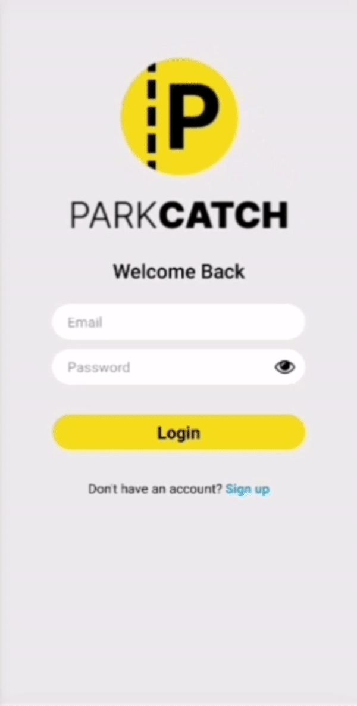
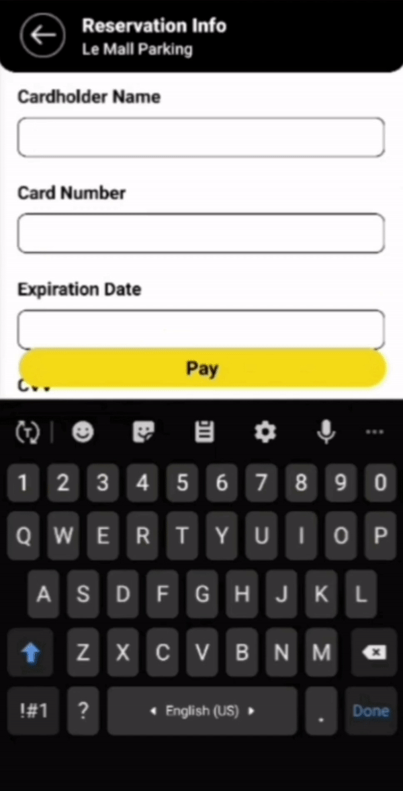

<div align="center">

> Welcome to ParkCatch! Your Smart Parking Solution.

<br><br>


<br>

**[PROJECT PHILOSOPHY](#project-philosophy) • [PROTOTYPING](#prototyping) • [TECH STACK](#tech-stack) • [DEMO](#demo) • [IOT](#iot) • [PERFORMANCE](#performance)• [HOW TO USE](#how-to-use)**

</div>

<br><br>


> ParkCatch allows drivers to find available parking lots nearby and reserve whatever available spot they want. It also provides directions from their current location to the destined parking lot.

<span style="font-size: 40px;"><strong>User Stories</strong></span>
- As a client, I want to see the available parking lots nearby so that I can choose one of them.
- As a client, I want to choose from the available spots in the parking lot so that I can reserve the spot I want.
- As a client, I want to pay online through my card so that I confirm my reservation.
- As a client, I want to get the directions to the chosen parking lot so that I know which route to take.

<br>

<span style="font-size: 40px;"><strong>Parking Lot Supervisor Stories</strong></span>
- As a supervisor, I want to see spots being reserved and the available ones so that I can track the traffic.
- As a supervisor, I want to get alerted if a spot is being taken by an unauthorized client so that I can reach out to the client and solve the issue.
- As a supervisor, I want to terminate the reservation of a client so that he/she will have to leave immediately in case of a conflict.
- As a supervisor, I want to make spots unavailable for clients during a certain time so that I can save them for specific people and make them available later on in case of an event and avoid the conflict of these spots being busy.

<br>

<span style="font-size: 40px;"><strong>Admin Stories</strong></span>
- As an admin, I want to access the spots reservation prices so that I can change the price when needed.
- As an admin, I want to access the banned list so that I can add the license plate number of any client that has violated the company’s policy.
- As an admin, I want to have control over the parking spots Availability on the website so that I can add or remove a spot availability if it's under maintenance.
- As an admin, I want to access the supervisors page so that I can create accounts for new supervisors.
- As an admin, I want to access the parking lot availability hours so that I can change the time when it opens and closes.

<br><br>


> ParkCatch was designed by employing wireframes and mockups in an iterative design process, achieving an optimal layout for user-friendly navigation and a seamless user experience.

<br>

<span style="font-size: 22px;"><strong>Mockups</strong></span>

<span style="font-size: 20px;"><strong>Client Screens (MobileApp)</strong></span>

| Login                             | SignUp                            | Home                             | Spots                             |
|-----------------------------------|-----------------------------------|----------------------------------|----------------------------------|
|  |  |  |  |

| Reservation Info                  | Reservation Payment               | Reservation Ticket                | Directions                        |
|-----------------------------------|----------------------------------|----------------------------------|-----------------------------------|
|  |  |  |  |

<br>

<span style="font-size: 20px;"><strong>Website</strong></span>

| Login                                                            | 
|------------------------------------------------------------------|
| 

<br>

<span style="font-size: 20px;"><strong>Supervisor Pages (Website)</strong></span>

| Reservation Alert                                                | Reservation Search                                                |
|------------------------------------------------------------------|-------------------------------------------------------------------|
|  |  |

<br>

<span style="font-size: 20px;"><strong>Admin Pages (Website)</strong></span>

| Edit Spot's Details                                              | Ban a Client                                                      |
|------------------------------------------------------------------|-------------------------------------------------------------------|
|  |  |


<br><br>


ParkCatch is built using the following technologies:

- [React Native Expo](https://expo.dev/): Expo allows developers to build cross-platform mobile apps for iOS, Android. It was used to develop the mobile app responsible for the client's use.
- [React](https://react.dev/): Used to build the website application where it uses a component-based architecture, making it easy to create reusable UI components and efficiently manage the UI state. It was used to built the website application for the parking lot supervisor and the admin.
- [Redux](https://redux.js.org/): It's a state container used both in React and React Native to manage the application's global state in a consistent and organized manner.
- [Laravel](https://laravel.com/): Is PHP framework that simplifies the development of applications by providing tools and conventions for tasks like routing, authentication, and database access. Used for the back-end development for the mobile app and the website.
- [MySQL](https://www.mysql.com/):  A relational database management system that store, retrieves, and manage structured data in various applications.
- [AWS](https://aws.amazon.com/): Amazon Web Services is a cloud computing platform that allows developers to deploy and scale applications easily without the need to manage physical infrastructure.
- [Arduino](https://www.arduino.cc/): Arduino consists of a microcontroller board and an integrated development environment. It was used for hardware integration, such as monitoring sensors which decides the parking spots availability.

<br><br>


<br>

<span style="font-size: 20px;"><strong>Client Screens (MobileApp)</strong></span>

| Login | Choose a Spot | Reservations | Reservation Payment & Directions|
| --- | --- | --- | --- |
|  |  |  |  |

<br><br>


<span style="font-size: 20px;"><strong>Prerequisites:</strong></span>
1. Clone the repo
   ```sh
   git clone https://github.com/MHoussam/ParkCatch.git
   ```

<span style="font-size: 20px;"><strong>Frontend (Mobile):</strong></span>
1. Navigate to mobileapp: 

   ```bash  
   cd mobileapp
   ``` 
2. Install dependencies:  

   ```bash  
     npm install 
   ``` 
3. Start development server: 

   ```bash  
   npx expo start  
   ``` 
<br>

<span style="font-size: 20px;"><strong>Frontend (Website):</strong></span>
1. Navigate to
   ```sh
   cd website
   ```
2. Install NPM packages
   ```sh
   npm install
   ```
3. Start the client
   ```sh
   npm start

   <br>

<span style="font-size: 20px;"><strong>Backend:</strong></span>
1. Navigate to the Server folder
   ```sh
   cd server
   ```
2. Rename `.env.example` to `.env` and set your credentials.
3. Database initialization 
   ```sh
   php artisan migrate
   ``` 
4. Database Seeding (Optional) 
   ```sh
   php artisan db:seed
   ``` 
5. Run the Server Locally
   ```sh
   php artisan serve
   ``` 
6. Run the Server for Arduino
   ```sh
   php artisan serve --host=0.0.0.0 --port=8000
   ``` 